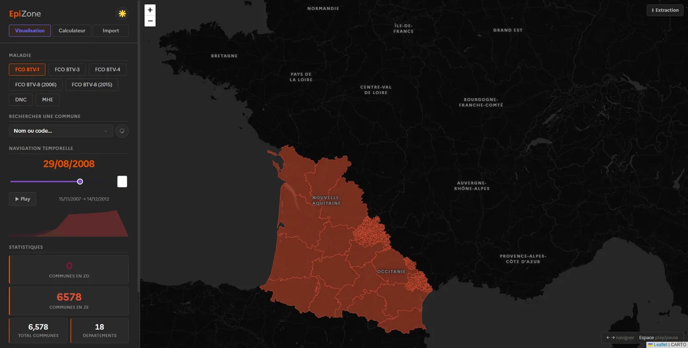

# EpiZone

**Outil de visualisation des zones sanitaires vétérinaires françaises**

EpiZone est une application web interactive permettant de consulter et naviguer dans l'historique des zonages réglementaires liés aux maladies animales réglementées en France (FCO, DNC, MHE, IAHP…). Elle est accessible en ligne à l'adresse **[epizone.fr](https://epizone.fr)** et peut également être installée localement.



---

## Fonctionnalités

- 🗺️ **Carte interactive** des zones réglementées par maladie et par date (ZP, ZS, ZR, ZV, ZR+ZV…)
- ⏱️ **Navigation temporelle** via un slider animé sur l'ensemble de l'historique disponible
- 🔍 **Recherche de commune** par nom ou code INSEE avec indication du département
- 🧮 **Calculateur de zones** : détermine les zones applicables autour d'une ou plusieurs communes avec rayon paramétrable
- 📊 **Données cheptel** (Recensement Agricole 2020) : effectifs bovins laitiers et allaitants par zone
- ⬇️ **Extraction des données** au format Excel (.xlsx) ou Parquet
- 🌙 **Thème clair/sombre**

---

## Installation locale

### Prérequis

- Python **3.10 ou supérieur** (testé jusqu'à 3.14)
- Git

### Étapes

**1. Cloner le dépôt**

```bash
git clone https://github.com/GohuFR/epizone.git
cd epizone
```

**2. Créer un environnement virtuel**

```bash
# Windows
python -m venv venv
venv\Scripts\activate

# macOS / Linux
python3 -m venv venv
source venv/bin/activate
```

**3. Installer les dépendances**

```bash
pip install -r requirements.txt
```

**4. Lancer l'application**

```bash
python app.py
```

**5. Ouvrir dans le navigateur**

```
http://localhost:8050
```

> ⚠️ Le **premier démarrage** peut prendre quelques minutes : l'application télécharge automatiquement les contours géographiques des communes depuis l'API [geo.api.gouv.fr](https://geo.api.gouv.fr) et les met en cache localement. Les démarrages suivants sont rapides.

---

## Structure du projet

```
epizone/
├── app.py                    # Point d'entrée — interface Dash
├── requirements.txt
├── engine/                   # Moteur de traitement
│   ├── config.py             # Parseur YAML
│   ├── loader.py             # Lecture des fichiers Excel
│   ├── pipeline.py           # Orchestrateur
│   ├── snapshots.py          # Calcul des états de zonage par date
│   ├── geometry.py           # Contours géographiques (cache auto)
│   ├── expansion.py          # Expansion département → communes
│   ├── cheptel.py            # Données Recensement Agricole 2020
│   ├── importer.py           # Assistant d'import
├── configs/                  # Configuration YAML par maladie
│   ├── fco_btv1.yaml
│   ├── fco_btv3.yaml
│   ├── fco_btv4.yaml
│   ├── fco_btv8_2006.yaml
│   ├── fco_btv8_2015.yaml
│   ├── dnc.yaml
│   └── mhe.yaml
├── data/                     # Données sources (Excel, Parquet)
│   ├── *.xlsx                # Fichiers de zonage par maladie
│   ├── regions_geo.parquet   # Contours des régions françaises
│   ├── cheptel_*.csv         # Données RA 2020 (Agreste)
├── assets/                   # Fichiers statiques
│   ├── style.css
│   └── fonts/                # Police Marianne (DSFR)
└── cache/                    # Généré automatiquement (ignoré par Git)
```

---

## Ajouter une maladie

Deux approches sont possibles :

### Via l'interface (onglet Import)

1. Préparer un fichier Excel avec les colonnes : `code_insee`, `commune`, `departement`, `region`, `date_debut`, `date_fin`, `zone`
2. Ouvrir l'onglet **Import** dans l'application
3. Uploader le fichier → l'assistant détecte les colonnes et génère la configuration automatiquement

### Manuellement

1. Placer le fichier Excel dans `data/`
2. Créer un fichier YAML dans `configs/` (copier un fichier existant comme base)
3. Redémarrer l'application

Voir la [documentation technique](docs/DOCUMENTATION_TECHNIQUE.docx) pour le détail du format YAML.

---

## Maladies disponibles

| Maladie | Période couverte | Zones |
|---|---|---|
| FCO BTV-1 | 2007 – 2012 | ZD, ZE |
| FCO BTV-3 | 2023 – en cours | ZR |
| FCO BTV-4 | 2017 – 2019 | ZR |
| FCO BTV-8 (2006) | 2006 – 2012 | ZD, ZE |
| FCO BTV-8 (2015) | 2015 – 2018 | ZR |
| DNC | 2022 – en cours | ZP, ZS, ZVI |
| MHE | 2023 – en cours | ZR, ZV, ZR+ZV |

---

## Extraction et accès aux données

### Depuis l'interface

Un bouton **⬇ Extraction** est disponible en haut à droite de la carte. Il permet de télécharger les données nettoyées de la maladie actuellement sélectionnée dans deux formats :

- **Excel (.xlsx)** — deux onglets :
  - `Periodes` : toutes les périodes de zonage commune par commune
  - `Departements_entiers` : périodes où un département est couvert à ≥ 99% par une seule zone
- **Parquet** — format binaire compressé, idéal pour un traitement sous Python/R

Les fichiers sont générés automatiquement au premier démarrage et placés dans `data/clean/`.

### Accès direct aux fichiers

Les fichiers sources sont accessibles directement dans le dépôt :

| Fichier | Format | Contenu |
|---|---|---|
| `data/*.xlsx` | Excel | Données sources brutes par maladie |
| `data/clean/*_periodes.xlsx` | Excel | Données nettoyées (généré localement) |
| `data/clean/*_periodes.parquet` | Parquet | Idem, format binaire compressé |
| `data/cheptel_communes.csv` | CSV | Effectifs bovins par commune (RA 2020) |
| `data/cheptel_departement.csv` | CSV | Effectifs bovins par département (RA 2020) |
| `data/cheptel_region.csv` | CSV | Effectifs bovins par région (RA 2020) |

> Les fichiers `data/clean/` ne sont pas inclus dans le dépôt Git (générés automatiquement au démarrage).

---

## Format des bases de données

### Format standardisé (nouveau format)

Toutes les maladies récentes utilisent un fichier Excel avec un **onglet unique `Periodes`** et les colonnes suivantes :

| Colonne | Type | Description | Exemple |
|---|---|---|---|
| `code_insee` | str | Code INSEE commune 5 chiffres | `74001` |
| `commune` | str | Nom de la commune | `Abondance` |
| `departement` | str | Nom du département | `Haute-Savoie` |
| `region` | str | Nom de la région | `Auvergne-Rhône-Alpes` |
| `date_debut` | date | Date d'entrée en zone | `2023-09-25` |
| `date_fin` | date | Date de sortie (vide si toujours active) | `2024-03-01` |
| `zone` | str | Identifiant de zone | `ZR`, `ZV`, `ZR+ZV` |

Exemple de contenu :

```
code_insee | commune      | departement   | date_debut | date_fin   | zone
-----------|--------------|---------------|------------|------------|-----
64001      | Abère        | Pyrénées-Atl. | 2023-09-25 | 2024-01-15 | ZR
64001      | Abère        | Pyrénées-Atl. | 2024-01-15 |            | ZV
64002      | Abidos       | Pyrénées-Atl. | 2023-09-25 |            | ZR
```

Une commune peut avoir **plusieurs lignes** si elle a changé de zone au cours du temps. Une ligne sans `date_fin` signifie que la commune est **toujours active** dans cette zone à la date de la dernière mise à jour.

### Codes INSEE

Les codes INSEE suivent le standard COG (Code Officiel Géographique) de l'INSEE :
- **5 chiffres** pour les communes métropolitaines (ex : `74001`)
- **Préfixe `2A` ou `2B`** pour la Corse (ex : `2A001`, `2B001`)
- Les arrondissements de Paris, Lyon et Marseille utilisent leurs codes spécifiques (ex : `75056` pour Paris)


L'application est conçue pour être déployée avec **Gunicorn** derrière un reverse proxy (Nginx, Cloudflare…).

```bash
gunicorn app:server -w 2 -b 0.0.0.0:8050 --timeout 120
```

Vérifier que `app.py` expose bien `server = app.server` (attribut standard Dash).

---

## Développement

Pour activer le mode développement (auto-reload, debug) :

```bash
# Windows
set EPIZONE_DEV=1
python app.py

# macOS / Linux
EPIZONE_DEV=1 python app.py
```

---

## Sources des données

Les données de zonage sont issues des **arrêtés ministériels et préfectoraux** publiés au Journal Officiel et sur [Légifrance](https://www.legifrance.gouv.fr) ou sur les recueils des actes admnistratifs des préfectures (RAA), librement accessibles.

Les données cheptel proviennent du **Recensement Agricole 2020** ([Agreste](https://agreste.agriculture.gouv.fr)), données publiques.

Les contours géographiques sont téléchargés depuis l'**API Géo** du gouvernement ([geo.api.gouv.fr](https://geo.api.gouv.fr)), données ouvertes.

---

## Crédits

Développé par **Hugo BLIN DA SILVA**
dans le cadre d'un stage de recherche à l'**[INRAE](https://www.inrae.fr)** — unité **[EPIA](https://www6.clermont.inrae.fr/epia)**
en formation à l'**[ENSV](https://www.ensv.fr)** / **[EnvA](https://www.vet-alfort.fr)** (Inspecteur Élève de Santé Publique Vétérinaire, promotion 2025-2026)

---

## Licence

[MIT License](LICENSE) — © 2026 Hugo BLIN DA SILVA
